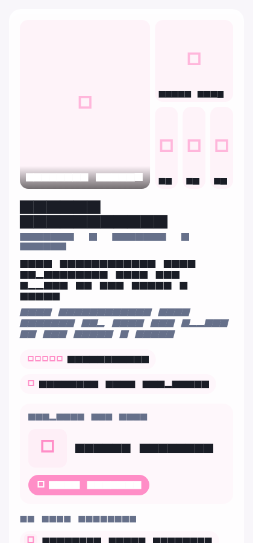
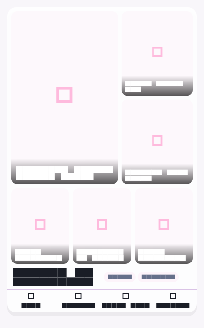

# Phase 1 Visual Board PR

## Summary

Phase 1 adds a feature-flagged, board-first visual inspiration card while
preserving the existing backend payload, parser, saved-board storage, carousel
behavior, and wardrobe board renderers.

Enable with:

```text
--dart-define=ENABLE_VISUAL_BOARD_85_LAYOUT=true
```

The default remains the legacy card until the flag is enabled.

## Files Changed

- `lib/feature/chat/widgets/blocks/visual_directions/ahvi_outfit_board_card.dart`
  - Adds the board-first card, collage grid, hero/support tiles, compact context
    strip, and action bar.
  - Keeps each support item's name and image URL in one immutable record.
  - Orders support items by bottom, footwear, bag, accessory, then other.
  - Omits report prose, analytical badges, ownership chips, and the inline
    missing-piece card.
  - Reuses `SavedBoardsStore` without changing its contract.
- `lib/feature/chat/widgets/blocks/visual_directions/visual_direction_carousel.dart`
  - Selects the new card behind `ENABLE_VISUAL_BOARD_85_LAYOUT`.
  - Adds a test-only/host override through `use85Layout`.
  - Renames the visible legacy `More` action to `Shuffle` while preserving the
    existing `Show more looks like ...` message.
- `lib/widgets/ahvi_stylist_chat.dart`
  - Forwards the existing prompt callback to the carousel so visual-board
    actions work in the stylist bottom sheet.
- `test/visual_board_85_phase1_test.dart`
  - Covers content suppression, action payloads, small-phone overflow, and
    before/after golden images.
- `test/goldens/visual_board_phase1_before.png`
- `test/goldens/visual_board_phase1_after.png`

## Before And After

### Before

The legacy card places the collage above long explanations, analytical badges,
ownership content, a large missing-piece panel, and actions. The full card does
not fit in one viewport.



### After

The Phase 1 card gives the collage approximately 80% of the fixed card height.
It keeps only the title, two compact context chips, and one action row beneath
the board.



## Behavior Preserved

- Backend response and action contracts are unchanged.
- `Shuffle` sends the existing message:
  `Show more looks like <direction>`.
- Save continues to use `SavedBoardsStore`.
- Style This sends the existing wardrobe prompt form:
  `Use my wardrobe for: <direction>`.
- Missing sends the existing shopping prompt form.
- Existing wardrobe board widgets are untouched.

## Test Results

Passed:

```text
flutter test test/board_story_test.dart \
  test/fashion_item_filter_test.dart \
  test/visual_board_85_phase1_test.dart

20 tests passed
```

The focused Phase 1 suite contains 6 passing tests, including both golden
captures.

Unresolved tooling:

- `flutter analyze` and `dart analyze` did not return diagnostics before their
  5-minute and 3-minute timeouts.
- The complete `flutter test` run timed out because the pre-existing
  `test/widget_test.dart` full-app smoke test did not finish. Running that test
  alone also timed out after 3 minutes.

The relevant unit and widget suites compile and pass.

## Rollout

1. Build an internal APK with
   `--dart-define=ENABLE_VISUAL_BOARD_85_LAYOUT=true`.
2. Verify visual-direction cards in full chat and the stylist bottom sheet.
3. Confirm Save, Shuffle, Style This, and Missing actions.
4. Disable the flag to return immediately to the legacy card.

No backend deployment is required.
